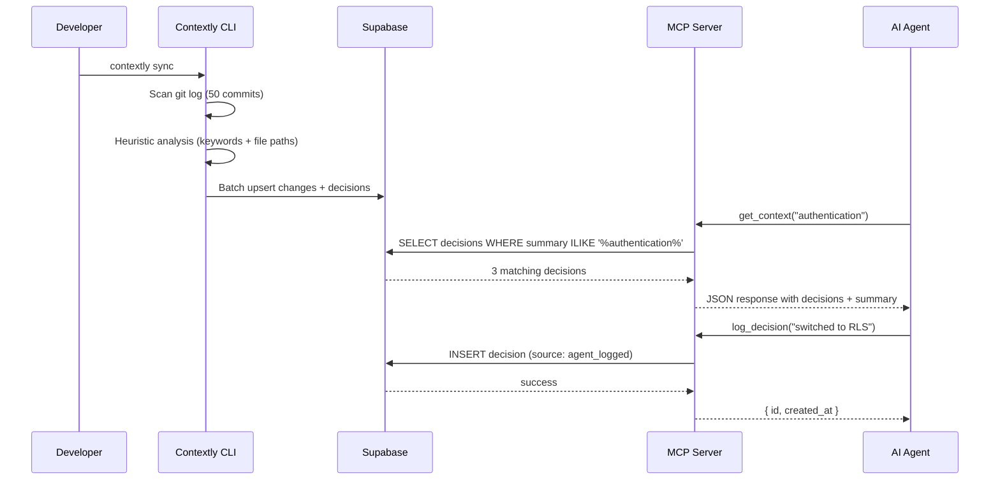

# Contextly

**Universal context layer for AI coding agents.**

Every AI coding tool — Claude Code, Cursor, Copilot, OpenCode — starts fresh. They don't know your architecture, your decisions, or why you chose Postgres over Mongo. Contextly fixes that. It's a persistent memory layer that lives between your codebase and your agents, so switching models never means starting over.

---

## How It Works

```
┌─────────────┐     ┌──────────────┐     ┌─────────────────┐
│  Developer   │────▶│  CLI / Git   │────▶│   Supabase DB   │
│  writes code │     │  sync + scan │     │  decisions +    │
└─────────────┘     └──────────────┘     │  changes table  │
                                          └────────┬────────┘
                                                   │
                                          ┌────────▼────────┐
                                          │   MCP Server    │
                                          │  query by topic │
                                          │  file, time     │
                                          └────────┬────────┘
                                                   │
                        ┌──────────────────────────┼──────────────────────┐
                        │                          │                      │
                 ┌──────▼──────┐          ┌────────▼────────┐   ┌────────▼────────┐
                 │ Claude Code │          │     Cursor      │   │    OpenCode     │
                 │  get_context│          │  explain_file   │   │ recent_changes  │
                 └─────────────┘          └─────────────────┘   └─────────────────┘
```

**The flow:**
1. `contextly sync` reads your git history, extracts architectural decisions, stores them in Supabase
2. Any AI agent connects via MCP (Model Context Protocol) using a per-project token
3. The agent asks questions like "why did we choose Supabase?" and gets real answers from your project memory
4. Agents can also write decisions back — so context accumulates across sessions

---

## Quick Start

### Install and initialize

```bash
# Install the CLI
npm install -g @contextly/cli

# Login with GitHub (one-time)
contextly login

# Initialize in your project
cd your-project
contextly init

# Sync git history into project memory
contextly sync
```

### Connect your AI agent

After `contextly init`, you'll have a `.contextly/mcp.json` file. Add this to your MCP client config:

**Claude Desktop** (`claude_desktop_config.json`):
```json
{
  "mcpServers": {
    "contextly": {
      "command": "npx",
      "args": ["-y", "@contextly/mcp-server"],
      "env": {
        "CONTEXTLY_TOKEN": "from .contextly/mcp.json",
        "SUPABASE_URL": "your-supabase-url",
        "SUPABASE_SERVICE_ROLE_KEY": "your-service-role-key"
      }
    }
  }
}
```

**Cursor** (`.cursor/mcp.json`):
```json
{
  "mcpServers": {
    "contextly": {
      "command": "npx",
      "args": ["-y", "@contextly/mcp-server"],
      "env": {
        "CONTEXTLY_TOKEN": "from .contextly/mcp.json",
        "SUPABASE_URL": "your-supabase-url",
        "SUPABASE_SERVICE_ROLE_KEY": "your-service-role-key"
      }
    }
  }
}
```

### Start asking questions

Once connected, your agent can use these tools:

| Tool | What it does | Example |
|------|-------------|---------|
| `get_context` | Query project memory by topic | "Why did we switch to Supabase?" |
| `explain_file` | Get decisions related to a file | "What's the history of src/auth.ts?" |
| `recent_changes` | See what changed in a time window | "What happened in the last 24h?" |
| `log_decision` | Record a decision for future agents | "We chose Redis for caching because..." |
| `get_project_brief` | Compressed project overview | Cold-start any new session |

---

## Architecture

### Components

```
packages/
├── cli/              # npx contextly — Node.js, Commander
├── mcp-server/       # MCP server — @modelcontextprotocol/sdk
├── dashboard/        # Next.js 16 — project management UI
└── shared/           # Types, schemas, utilities
```

### Data Flow



### Database Schema (core tables)

| Table | Purpose |
|-------|---------|
| `projects` | Project config, MCP token, GitHub repo URL |
| `decisions` | Architectural decisions (the "why") |
| `changes` | Git commits synced to project memory |
| `project_members` | Team access with roles (owner/member/viewer) |
| `profiles` | User accounts, subscription status |
| `rate_limits` | Database-level rate limiting |
| `audit_logs` | Security event tracking |

### Security Model

- **RLS-first**: All data access controlled by Row Level Security policies at the database level
- **Per-project tokens**: Each project gets a unique `ctx_` token for MCP authentication
- **Rate limiting**: Database-level rate limiting via `is_rate_limited()` RPC
- **Input sanitization**: All user input escaped before storage
- **Webhook verification**: GitHub webhook signatures verified with HMAC-SHA256

---

## CLI Commands

| Command | Description |
|---------|-------------|
| `contextly login` | Authenticate with GitHub (Device Flow) |
| `contextly logout` | Clear local session |
| `contextly init` | Initialize Contextly in current directory |
| `contextly sync` | Sync git history into project memory |
| `contextly log <msg>` | Log an architectural decision |
| `contextly status` | Show project memory status |

---

## Development

### Prerequisites

- Node.js v20+
- Docker (for local Supabase)
- [Supabase CLI](https://supabase.com/docs/guides/cli)

### Local Setup

```bash
# Clone the repo
git clone https://github.com/GetContextly/contextly.git
cd contextly

# Install dependencies
npm install

# Start local Supabase
cd supabase && supabase start && cd ..

# Set up environment
cp .env.example .env
# Fill in your Supabase keys

# Run tests
npx vitest run

# Build all packages
npm run build
```

### Running individual packages

```bash
# Dashboard
npm run dev -w packages/dashboard

# MCP Server
npm run dev -w packages/mcp-server

# CLI (dev mode)
cd packages/cli && npm run dev
```

### Testing

```bash
# Run all tests
npx vitest run

# Run specific package tests
npx vitest run packages/shared
npx vitest run packages/cli
npx vitest run packages/mcp-server
```

---

## How Context Is Kept

### Layer 1: Git History → Changes Table

When you run `contextly sync`, the CLI reads your last N commits and stores each as a row in the `changes` table. This is a record of *what* happened.

### Layer 2: Heuristic Analysis → Decisions Table

The analyzer checks if commits contain architectural keywords (`refactor`, `schema`, `auth`, `database`, `middleware`, `cache`, etc.) or touch architectural paths (`schema/`, `migration/`, `auth/`, `.github/`). Matches become rows in the `decisions` table — the *why*.

### Layer 3: Agent Logging → Decisions Table (source: "agent_logged")

When an agent calls `log_decision`, it writes directly to the decisions table. This is how context accumulates *during* work, not just from git history.

### Layer 4: GitHub Webhooks → Auto-Sync

When you push to a connected repo, the webhook handler:
1. Logs each commit as a change
2. Runs the same heuristic analysis to extract decisions
3. PR merges are logged as decisions with `source: "pull_request"`

---

## Roadmap

- [ ] Embeddings for semantic search (pgvector schema exists, needs generation)
- [ ] Auto-sync on every push via GitHub webhooks (handler exists, needs testing)
- [ ] LLM-based decision extraction (replace keyword heuristic)
- [ ] Rolling project brief that updates as decisions accumulate
- [ ] Team collaboration features (shared projects, role-based access)
- [ ] Vercel deployment integration

---

## License

ISC © [GetContextly](https://github.com/GetContextly)
